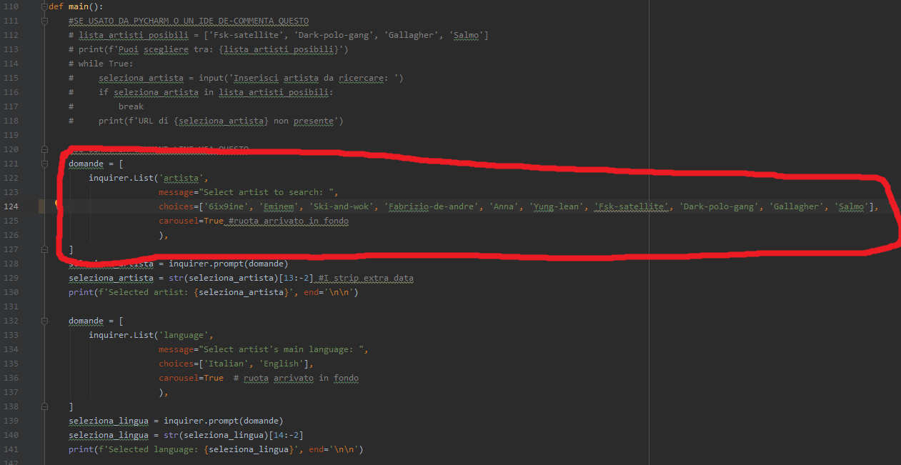
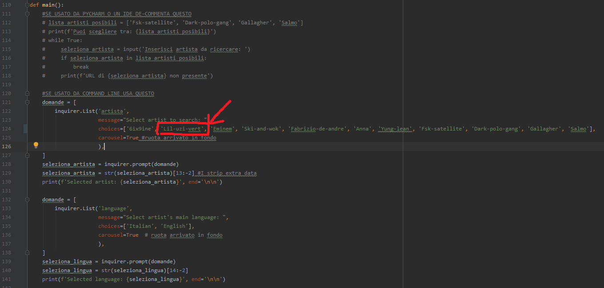
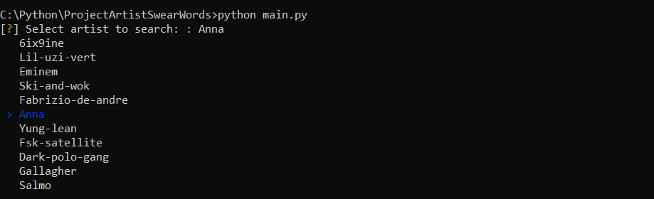
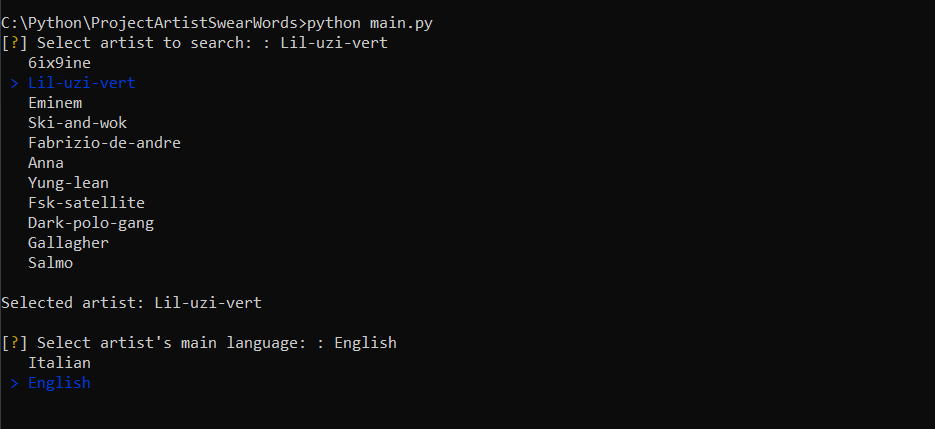
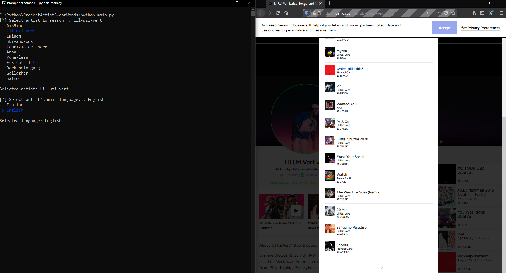
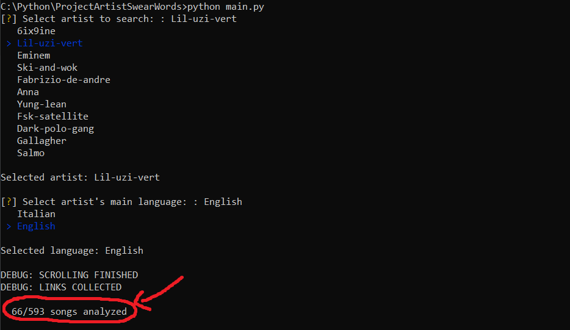
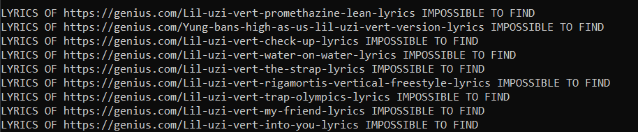
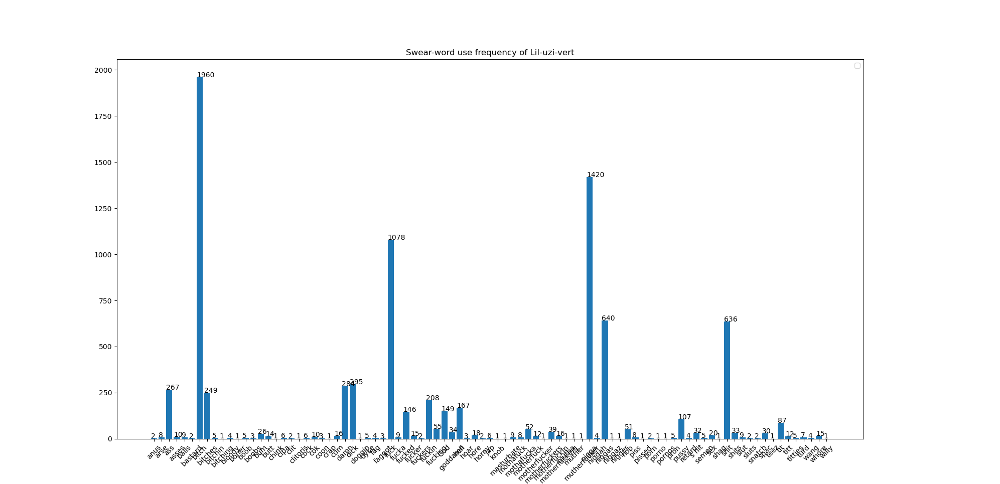

# PYTHON SCRIPT TO COUNT HOW MANY BAD WORDS AN ARTIST SAID 

**Clone the repo** and launch the script in the folder by typing 'python main.py'

* You can **choose** which artist to search
* To add a new artist you need to look for the [final part of their genius.com URL](www.genius.com)
    * **Example**: Say you want to add Lil Uzi Vert to the list of artists that can be searched
    * You need to look for their [genius.com](www.genius.com) URL -> [https://genius.com/artists/Lil-uzi-vert](https://genius.com/artists/Lil-uzi-vert)
    * Select the final '/', so only 'Lil-uzi-vert'
    * Now add it to the list 
    
    and so
    
    * You're done!

* Select the artist from the menu
  

* And finally choose the artist's main language
  
  
* It will automatically open the artist's Genius webpage and scroll through all the songs featured on the website
  

* Once finished collecting all links to the songs it will close the webpage and start downloading all the lyrics
  
  
* If a link is corrupted the script will let you know it did not retrieve the lyrics of that song
  
  
* The final result will be a bar graph showing the use of swear/bad words during his career   
   > As seen, I have to fix the xticks spacing when the words are too many

# To do
- [ ] Improve the resulting graphs
- [ ] Try to use Requests and BeautifulSoup for link collection instead of Selenium Web-Driver to get a faster script
- [ ] Add multiple options
- [ ] Make in-line menu more user-friendly
- [ ] Divide swear-words by type <br/ > 
         1. Sex-oriented bad words
         2. Race-oriented insults
         3. General insults
         4. Etc.
- [ ] Add multiple languages
